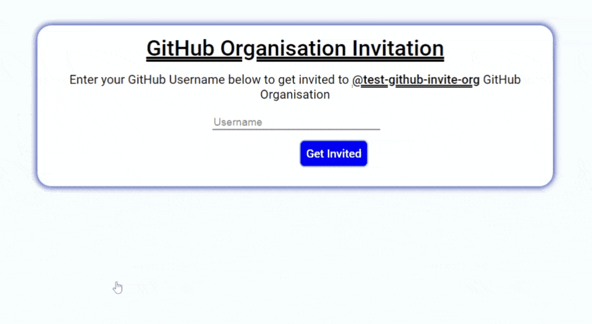

# GitHub Organisation Invitation - Monolith Server Version

A web app that can accept a GitHub username and send them an invitation to join a GitHub Organisation.

You can host or serve it and provide users with the frontend, in which they can enter their GitHub username and get invited to your GitHub organization.

## Add org.js file

Add an org.js file in the root of this repository for this app to work. The file should export the name of the GitHub organisation to be joined and a personal access token of an admin in that GitHub organization.

Only admin members of a GitHub organisation can send an invitation to other GitHub users, to join that organisation.
The admin member must be authenticated before invitation can be sent. Go to settings in admin's GitHub account and get a new personal access token or use an existing token, if you already have one. Ensure that the token has at least, the admin:org (full control of orgs and teams, read and write org projects) permission when the token was created.
Create a file in the root of this repository and name it `org.js`.
Export an object containing the name of the organisation to joined and your personal access token.

Example: in `org.js`

```
module.exports = {
  name: <NAME OF ORGANISATION ON GITHUB>,
  token: <PERSONAL ACCESS TOKEN OF AN ADMIN IN THAT ORGANISATION>
};
```

`org.js` has been added to .gitignore so that credentials are not committed to Git.

#### Note on .gitignore

If you host this node app with cloud providers that leverage git, then you will have to remove `org.js` from `.gitignore`, so that the `git push` can push the file equally, else the app will not work.

## The FrontEnd

In the home of your app, a GitHub user can enter their `username` and get invited to your organization. They will receive proper feedback, whether they was successfully invited or not and possible reasons for that.

## Customizing
Feel free to customize the frontend to suit your brand's guidelines. However, avoid tampering with the parts of the code that give feedback and make the app work.

## Demo


